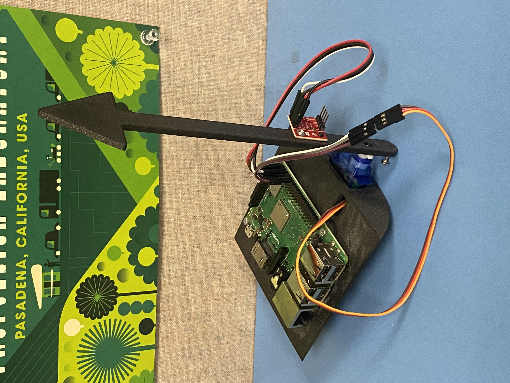

# Linux PWM Driver

## Description 

The actuator component is designed to demonstrate a
continuous feedback loop between a sensor and 
an actuator. In this case, the sensor is an IMU
and the actuator a servo. The goal of the actuator 
component is to point an arrow (of F' logo) directly upwards.
In practice, the IMU is mounted on the arrow, the arrow 
is mounted to the servo, and the servo is attached to 
some base (or held).

## Design  

Two main things take places in the actuator component.
1. Data from the IMU's Y-vector is taken into an array,
or "window", and averaged to limit noise.
2. IMU data is used to determine how far the arrow is 
from vertical, and an adjustment is made. Roughly speaking,
a P-controller is used to point the arrow vertically. 

## Hardware
1. Raspberry pi
2. SG90 servo 
3. 3D printed structure (optional, but encoraged)
4. F' logo or arrow
5. IMU 

## Assembly

